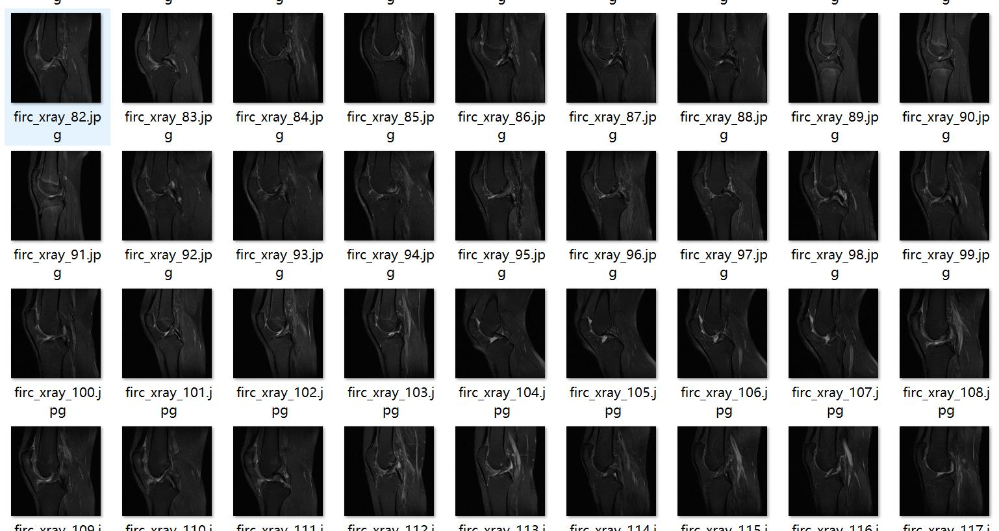
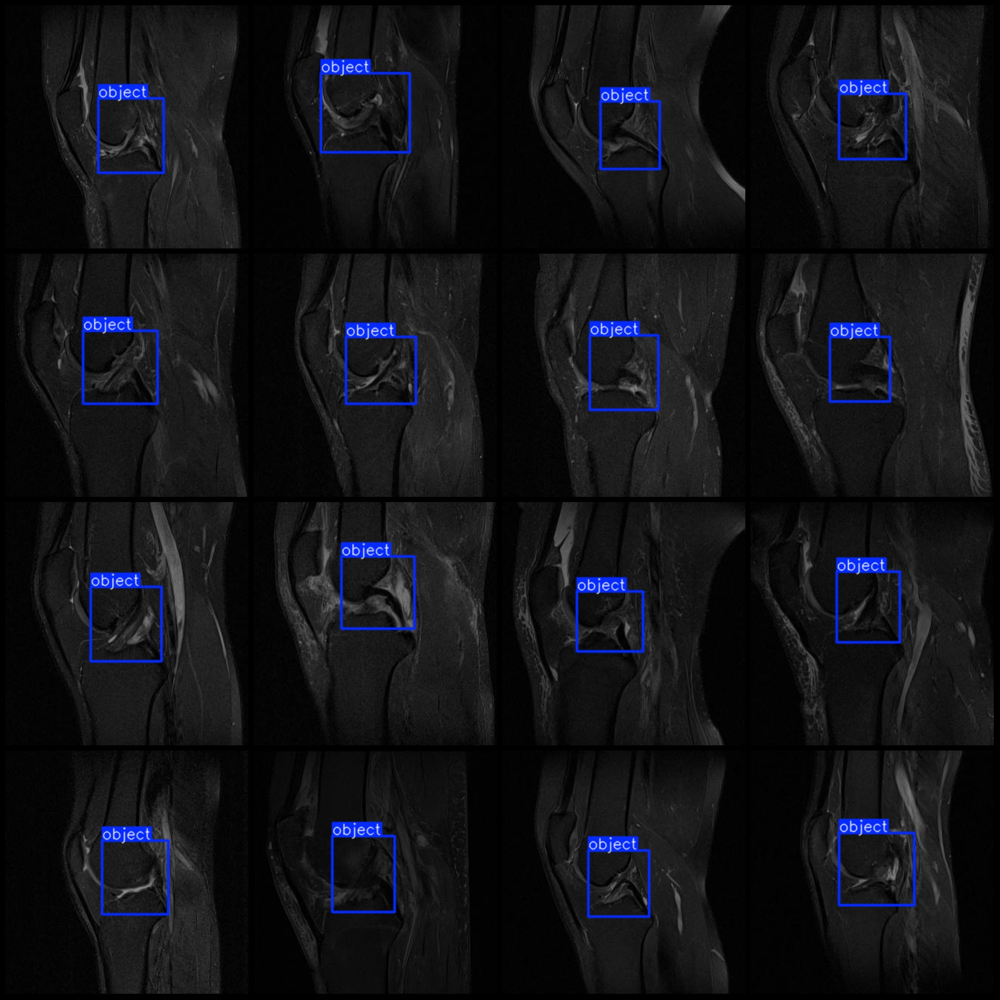
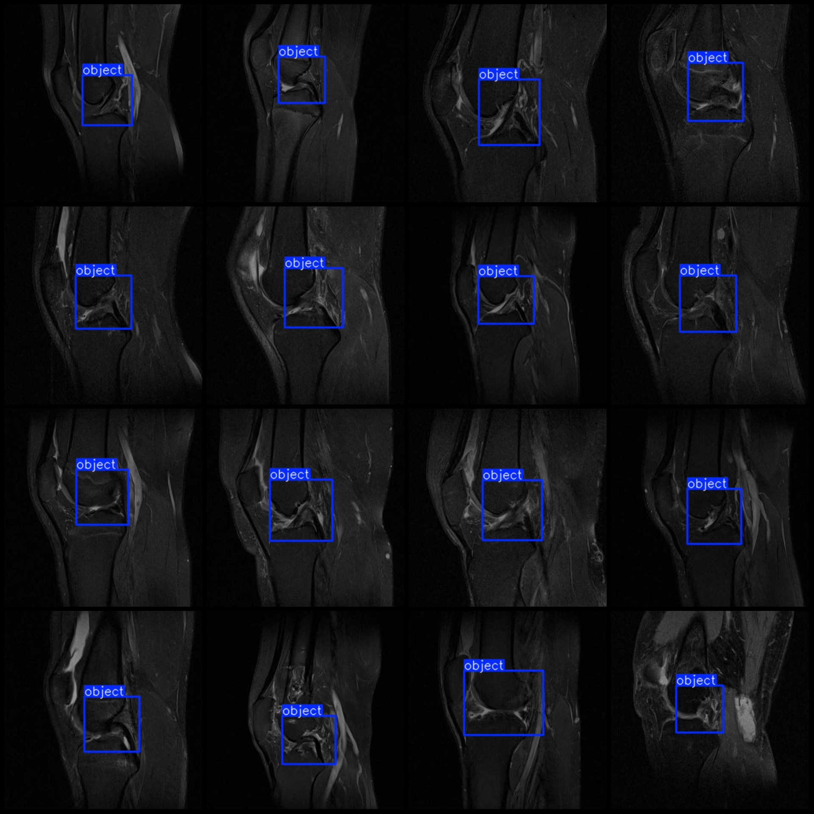

# Smart Health X-ray Image ACLK Detection Data Set VOC+YOLO Format with 3059 Images in 1 Category

Note: The resolution of the dataset images is slightly small, all at 320x320, slightly blurry.
Dataset format: Pascal VOC format + YOLO format (txt file without split path, only containing jpg images and corresponding VOC format xml files and yolo format txt files)
Number of images (jpg file count): 3059
Number of annotations (xml file count): 3059
Number of annotations (txt file count): 3059
Number of annotations categories: 1
Annotation category name: ["object"]
Number of bounding boxes per category:  
Object bounding box count = 3059  
Total bounding boxes: 3059  
Image resolution: 320x320  
Annotation tool used: labelImg  
Annotation rules: drawing a rectangle around the category for each object  
Important note: The dataset does not have been divided into training, validation, and test sets; you need to divide them yourself.
Special statement: This dataset does not guarantee the accuracy of the trained models or weight files.
Image preview:  
Annotation example:

## Images

Here is a pay link on Stripe ( https://buy.stripe.com/3cs8yP7sY87d0vu9AB ). Please contact me lonlonago@foxmail.com after funding $89, and I will send you a complete data files , thank you!

